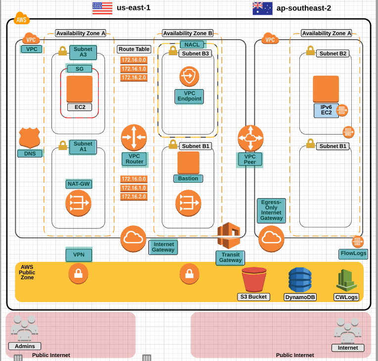

# VPC

## Virtual Private Cloud Essentials

VPC enables you to launch AWS resources into a virtual network.

### Features

- private/public subnets
- ability to extend network to the cloud as if it was part of your network

### Properties

- VPC is housed within a chosen AWS region
- VPC spans multiple availability zones within a region
- AWS provides a DNS server for you VPC. You can run your own DNS server by changing DHCP

### Default VPC

- created with account
  - can be deleted and recreated
  - allowed only one default vpc per account
- all subnets have a route to the internet
- each instance in default VPC (by default) has a private and public IP

### Limits

- 5 VPCs per region
- 5 internet GW per region
- 5 elastic IP
- 50 VPN connections per region

